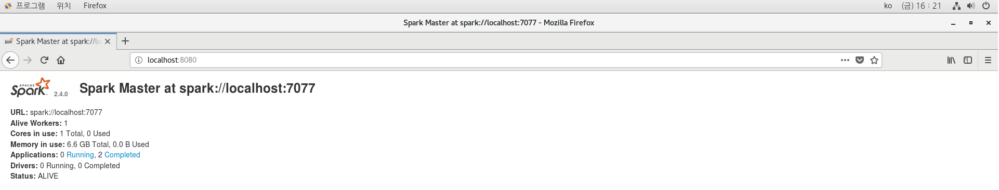
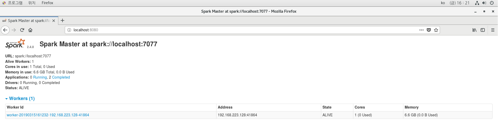
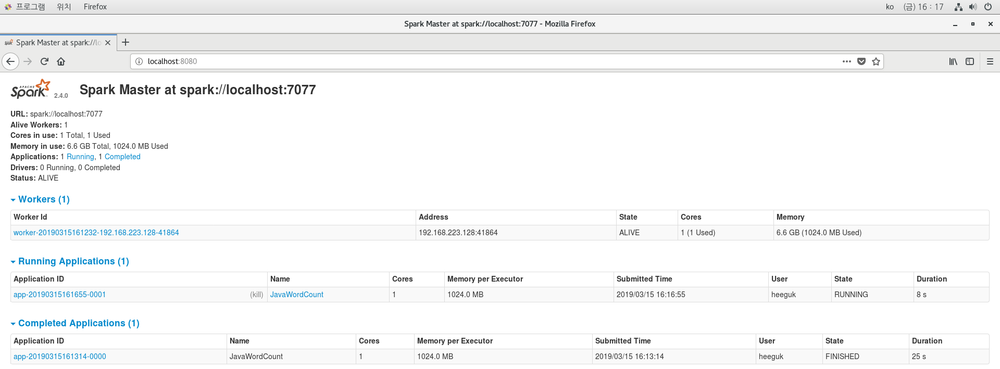
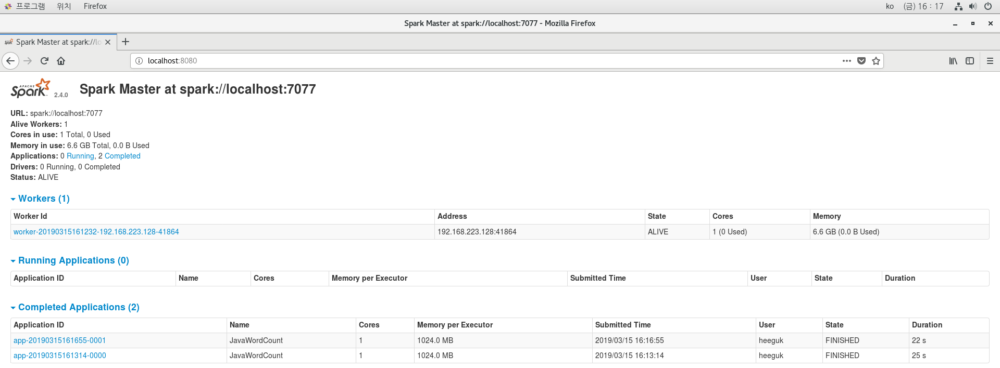

## Starting a Cluster
#### 1. Create a standalone master
	~~~
	./sbin/start-master.sh
	~~~
2. Get \<master-spark-URL\>
	~~~
	http://localhost:8080
	~~~
	In this page, you can get  \<master-spark-URL\>
	
	
	
	My \<master-spark-URL\> is spark://localhost:7077 
	
4. Start one or more workers and connect them to master
	~~~ 
	./sbin/start-slave.sh <master-spark-URL>
	~~~
	example code
	~~~
	./sbin/start-slave.sh spark://localhost:7077
	~~~
	
	A worker is connected to master
	
  	
5. Start a application
	~~~
	bin/spark-submit --master <Spark-Master URL> --class <Package name>.<Class name> <application name>.jar
	~~~
	
	Running Applications
	
  	
6. END
	
	Completed Applications
	
  	
