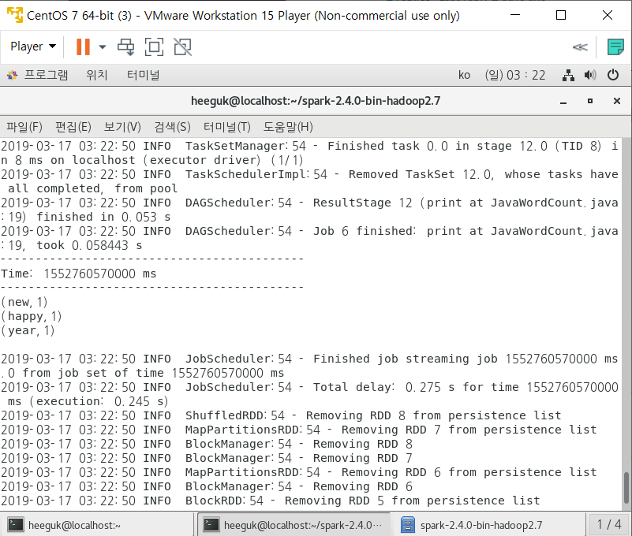

# 자바를 활용한 스파크 스트리밍

## 1. pom.xml 수정
이번 과제에선 스파크 스트리밍을 활용해야 하기 때문에, 기존 pom.xml 파일에 dependency를 추가해야 한다.
~~~
<dependency>
    	<groupId>org.apache.spark</groupId>
    	<artifactId>spark-streaming_2.11</artifactId>
    	<version>2.4.0</version>
</dependency>
~~~
dependency를 추가함으로서 spark streaming을 위한 추가적인 라이브러리를 사용할 수 있다. 
사용되는 라이브러리는 다음과 같다.
~~~
import org.apache.spark.streaming.*;
import org.apache.spark.streaming.api.java.*;
~~~
## 2. 라이브러리 설정
로컬 SparkContext와 Streaming Context를 활용하기 위해 해당 라이브러리를 추가한다.
~~~
import org.apache.spark.*;
import org.apache.spark.streaming.*;
import org.apache.spark.streaming.api.java.*;
~~~
추가적으로, 뒤에 사용 될 함수를 위해 다음 라이브러리도 추가한다.
~~~
import scala.Tuple2;
import java.util.Arrays;
~~~
## 3. 스레드 생성 및 배치 설정
두개의 스레드를 가진 로컬 Streaming Context를 생성하고, 배치의 간격을 10초로 설정한다. 
~~~
SparkConf conf = new SparkConf().setAppName("ex4").setMaster("local[2]");
JavaStreamingContext jssc = new JavaStreamingContext(conf, Durations.seconds(10));
~~~
## 4. DStream 생성
로컬호스트 9999포트로 접근하는 DStream을 생성한다. 
jssc.socketTextStream 함수는 특정 소켓의 텍스트 스트림을 보기 위한 스파크 스트리밍 함수이다. 
아래 코드를 통해 함수가 실행되는 로컬 PC의 9999 포트를 통해 Input text를 가져온다.
~~~
JavaReceiverInputDStream<String> lines = jssc.socketTextStream("localhost", 9999);
~~~

## 5. 데이터 처리
위 과정을 통해 받은 데이터를 처리해보자. 
우선 아래 함수를 통해 받아온 인풋을 워드 단위로 나눈다.
~~~
JavaDStream<String> words = lines.flatMap(x -> Arrays.asList(x.split(" ")).iterator());
~~~
데이터를 나눈뒤 각 배치(10초)에 포함된 단어의 개수를 센다.
~~~
JavaPairDStream<String, Integer> pairs = words.mapToPair(s -> new Tuple2<>(s, 1));
JavaPairDStream<String, Integer> wordCounts = pairs.reduceByKey((i1, i2) -> i1 + i2);
~~~
결과를 확인하기 위해 콘솔창에 각 RDD에 있는 10개의 데이터를 출력한다.
~~~
wordCounts.print();
~~~
## 6. 스트리밍 연산
가장 중요한 스트리밍 연산을 하기 위해 아래 코드를 추가한다.
~~~
jssc.start();
jssc.awaitTermination();
~~~
jssc.start() 함수는 스트리밍 연산을 시작하는 것이고,
jssc.awaitTermination() 함수는 스트리밍 연산의 종료를 기다리는 함수이다. 
연산이 종료되지 않으면 스트리밍은 멈추지 않고 계속 스트리밍을 읽기 위해 대기한다.
ctrl + c 로 종료할 수 있다.

## 7. .jar 파일 생성
코드가 완성되었으면 .jar 파일을 생성한다.
완성된 코드는 다음과 같다.
~~~
package spark1;

import org.apache.spark.*;
import org.apache.spark.streaming.*;
import org.apache.spark.streaming.api.java.*;

import scala.Tuple2;
import java.util.Arrays;

public final class JavaWordCount {
public static void main(String[] args) throws Exception {
	  SparkConf conf = new SparkConf().setAppName("ex4").setMaster("local[2]");
	  JavaStreamingContext jssc = new JavaStreamingContext(conf, Durations.seconds(10));
	  JavaReceiverInputDStream<String> lines = jssc.socketTextStream("localhost", 9999);
	  JavaDStream<String> words = lines.flatMap(x -> Arrays.asList(x.split(" ")).iterator());
	  
	  JavaPairDStream<String, Integer> pairs = words.mapToPair(s -> new Tuple2<>(s, 1));
	  JavaPairDStream<String, Integer> wordCounts = pairs.reduceByKey((i1, i2) -> i1 + i2);
	  wordCounts.print();
	  
	  jssc.start();              // Start the computation
	  jssc.awaitTermination();   // Wait for the computation to terminate
  }
}
~~~
해당 코드를 빌드한 뒤, 자바 어플리케이션 파일을 생성한다.
## 8. 스파크 어플리케이션 실행
빌드가 끝났다면 스파크 어플리케이션을 실행해보자. 
스파크가 설치된 디렉토리로 이동한 뒤 다음 명령어를 통해 스파크 어플리케이션을 실행한다.
~~~
bin/spark-submit --class spark1.JavaWordCount ex4.jar localhost 9999
~~~
## 9. 데이터 전송
어플리케이션이 실행되고 있다면 새로운 터미널 창을 연 뒤, 데이터를 9999포트로 전송해보자. 터미널에 다음 명령어를 수행한다.
~~~
nc -lk 9999
~~~
그리고 아무 문자나 입력한 뒤 엔터를 눌러 전송한다.
~~~
happy new year cheer up baby
~~~
## 10. 결과 확인
스파크 스트리밍이 제대로 구현됐다면 다음과 같은 결과를 얻을 수 있다. 
{: width="300px" height="300px"}

